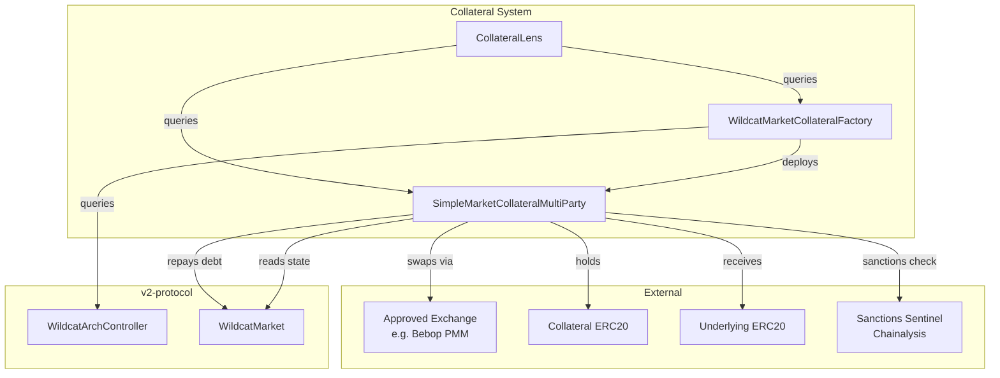
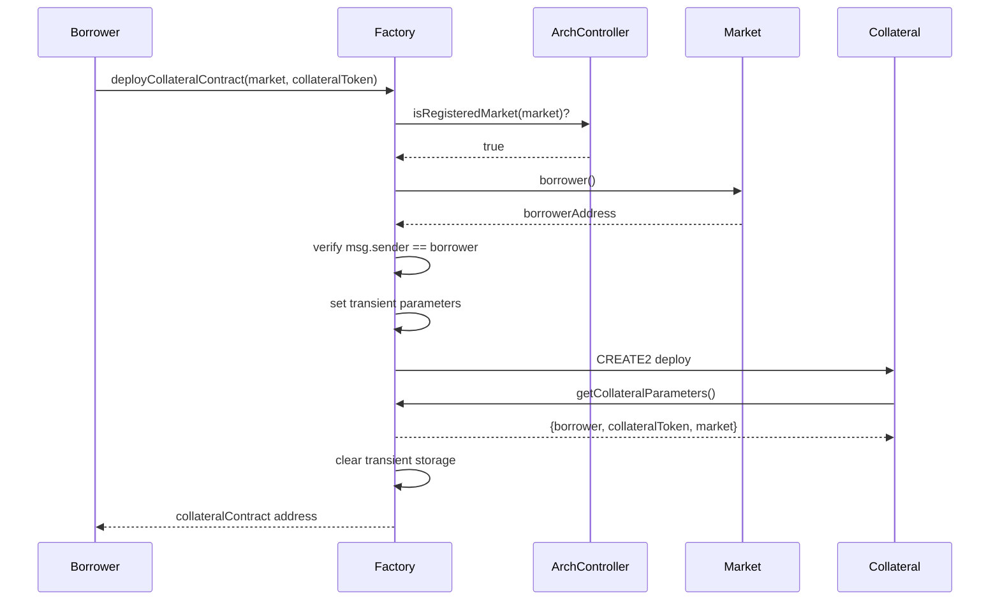
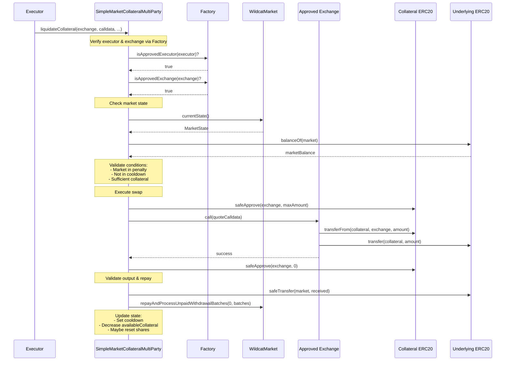
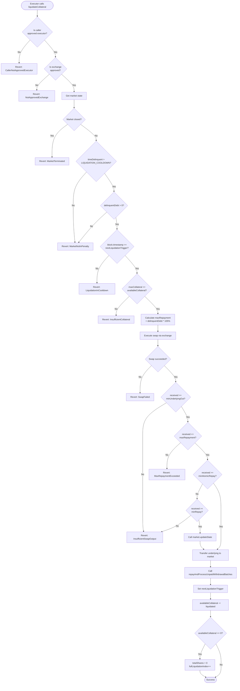

# Collateral-Contracts Security Review Prep

## Basic Info

| Protocol Name                                |     |
| -------------------------------------------- | --- |
| Website                                      | https://wildcat.finance/ |
| Link To Documentation                        | https://docs.wildcat.finance/ |
| Point of Contact | Telegram Channel |

## Code Details

| https://github.com/wildcat-finance/collateral-contract  |     |
| ------------------------------------------------------- | --- |
| Commit hash                                             | 2341f068fa11ac0c0532f107cbac9199718b3836 |
| Number of Contracts in Scope                            | 6   |
| Total SLOC for contracts in scope                       | 816 |
| Complexity Score                                        | 573 |
| How many external protocols does the code interact with | approved exchanges |
| Overall test coverage for code under audit              | 90% |

### In Scope Contracts

```
./src/
#-- interfaces
|   #-- CollateralStruct.sol
|   #-- IWildcatMarket.sol
#-- lens
|   #-- CollateralContractData.sol
|   #-- CollateralLens.sol
#-- SimpleMarketCollateralMultiParty.sol
#-- WildcatMarketCollateralFactory.sol
```

## Protocol Details

| Current Status                                                      |     |
| ------------------------------------------------------------------- | --- |
| Is the project a fork of the existing protocol                      | No  |
| Does the project use rollups?                                       | Yes |
| Will the protocol be multi-chain?                                   | Yes |
| Specify chain(s) on which protocol is / would be deployed           | Ethereum, Plasma, tbd |
| Does the protocol use external oracles?                             | Yes (sanctions oracle only, not price) |
| Does the protocol use external AMMs?                                | Yes |
| Does the protocol use zero-knowledge proofs?                        | No  |
| Which ERC20 tokens do you expect to interact with smart contracts   | Any non-rebasing no-fee |
| Which ERC721 tokens do you expect to interact with smart contracts? | None |
| Are ERC777 tokens expected to interact with protocol?               | No  |
| Are there any off-chain processes (keeper bots etc.)                | No  |

## Protocol Risks

| | | 
| ---------------------------------------------------------------------------- | --- |
| Should we evaluate risks related to centralization?                          | No  |
| Should we evaluate the risks of rogue protocol admin capturing user funds?   | No  |
| Should we evaluate risks related to deflationary/ inflationary ERC20 tokens? | No (out of scope; disallowed collateral) |
| Should we evaluate risks due to fee-on-transfer tokens?                      | No (out of scope; disallowed collateral) |
| Should we evaluate risks due to rebasing tokens?                             | No (out of scope; disallowed collateral) |
| Should we evaluate risks due to the pausing of any external contracts?       | No  |
| Should we evaluate risks associated with external oracles (if they exist)?   | Yes (sanctions oracle only) |
| Should we evaluate risks related to blacklisted users for specific tokens?   | Yes (sanctions) |
| Is the code expected to comply with any specific EIPs?                       | No  |

## Overview

The Wildcat Collateral Contract system enables borrowers to deposit collateral assets that can be liquidated when the associated Wildcat lending market enters a penalized delinquency state. The system supports multiple depositors with fair distribution of liquidation costs.

### Core Components

| Contract | Purpose |
|----------|---------|
| `SimpleMarketCollateralMultiParty` | Main collateral contract with multi-depositor share accounting |
| `WildcatMarketCollateralFactory` | Factory for deploying collateral contracts via Create2 |
| `CollateralLens` | Read-only query contract for aggregating collateral data |

### Key Design Decisions

1. **Internal Balance Tracking**: Uses internal `availableCollateral` rather than `balanceOf` to prevent donation attacks
2. **Share-Based Accounting**: Depositors receive shares proportional to their deposit, enabling fair liquidation distribution
3. **Full Liquidation Index**: Tracks complete liquidations to reset stale depositor shares
4. **Liquidation Cooldown**: 1-hour minimum between liquidations to prevent rapid extraction

---

## Contract Architecture



---

### Deployment Flow



---

## Contract: SimpleMarketCollateralMultiParty

### Storage Layout

| Slot | Variable | Type | Description |
|------|----------|------|-------------|
| 0 | `totalShares` | `uint224` | Total active shares across all depositors |
| 1 | `availableCollateral` | `uint256` | Internal balance of collateral (deposits - liquidations - withdrawals) |
| 2 | `nextLiquidationTrigger` | `uint32` | Timestamp when next liquidation is allowed |
| 3 | `fullLiquidationIndex` | `uint32` | Counter incremented on each full liquidation |
| mapping | `_depositors` | `mapping(address => Depositor)` | Per-depositor share and liquidation tracking |

### Immutables

| Variable | Type | Description |
|----------|------|-------------|
| `factory` | `address` | Factory that deployed this contract |
| `collateralAsset` | `address` | ERC20 token used as collateral |
| `market` | `IWildcatMarket` | Associated Wildcat lending market |
| `marketBorrower` | `address` | Borrower of the market (has rescueTokens permission) |
| `sanctionsSentinel` | `IWildcatSanctionsSentinel` | Sanctions oracle sentinel for account checks |
| `underlyingAsset` | `address` | Market's underlying asset (received from liquidations) |
| `LIQUIDATION_COOLDOWN` | `uint32` | 3600 seconds (1 hour) |
| `maxRepaymentBips` | `uint16` | 10500 (105% of delinquent debt) |

### Functions

```solidity
function deposit(uint256 _amount) public marketOpen nonReentrant returns (bool)
```
```solidity
function reclaimCollateral() public marketClosed nonReentrant
```
```solidity
function liquidateCollateral(
    address exchange,
    bytes calldata quoteCalldata,
    uint lengthWithdrawalQueue,
    uint maxCollateralToLiquidate,
    uint minUnderlyingOut
) public onlyApprovedExecutor onlyApprovedExchange(exchange) nonReentrant
    returns (uint underlyingAmountReceived)
```
```solidity
function rescueTokens(address token) public onlyBorrower nonReentrant
```

### View Functions

| Function | Returns | Description |
|----------|---------|-------------|
| `sharesOf(address)` | `uint256` | Account's active shares (0 if fully liquidated) |
| `getDepositor(address)` | `Depositor` | Full depositor struct with liquidation check |
| `getReclaimableAmount(address)` | `uint256` | Collateral withdrawable by account |
| `getMarketDelinquencyStatus()` | `(bool, uint256)` | Whether market is in penalty and delinquent debt |

---

### Liquidation State Breakdown

`liquidateCollateral` gates on market state before it ever considers collateral sufficiency. The four meaningful market states are:

1. **Market closed** (`state.isClosed == true`)  
   - Revert: `MarketTerminated`
2. **Market open, not in penalty** (`timeDelinquent <= LIQUIDATION_COOLDOWN`)  
   - Revert: `MarketNotInPenalty`
3. **Market open, in penalty but no delinquent debt** (`delinquentDebt == 0`)  
   - Revert: `MarketNotInPenalty`
4. **Market open, in penalty, delinquent debt > 0**  
   - Proceeds to cooldown and collateral checks, then swap/repay logic.

Collateral sufficiency (`maxCollateralToLiquidate <= availableCollateral`) is only evaluated in state 4; all other states revert earlier.

### Liquidation Sequence



### Liquidation Flow



---

## Contract: WildcatMarketCollateralFactory

### Storage Layout

| Variable | Type | Description |
|----------|------|-------------|
| `_tmpCollateralParameters` | `TransientBytesArray` | Transient storage for deployment params |
| `collateralContractsByMarket` | `mapping(address => address[])` | Deployed contracts per market |
| `_approvedExecutors` | `EnumerableSet.AddressSet` | Accounts allowed to trigger liquidations |
| `_approvedExchanges` | `EnumerableSet.AddressSet` | DEXs allowed for liquidation swaps |

### Immutables

| Variable | Type | Description |
|----------|------|-------------|
| `ownCreate2Prefix` | `uint256` | Precomputed Create2 prefix |
| `collateralInitCodeStorage` | `address` | SSTORE2 address of init code |
| `collateralInitCodeHash` | `uint256` | Hash for Create2 address calculation |
| `archController` | `address` | WildcatArchController for authorization |

### Functions

```solidity
function deployCollateralContract(
    address marketAddress,
    address collateralToken
) public returns (address collateralContract)
```

### Admin Functions (onlyArchControllerOwner)

| Function | Description |
|----------|-------------|
| `approveExecutor(address)` | Add address to approved liquidators |
| `removeExecutor(address)` | Remove address from approved liquidators |
| `approveExchange(address)` | Add DEX to approved exchanges |
| `removeExchange(address)` | Remove DEX from approved exchanges |


### View Functions

| Function | Returns | Description |
|----------|---------|-------------|
| `calculateCollateralContractAddress(market, token)` | `address` | Deterministic address for potential deployment |
| `getCollateralContractsForMarket(market)` | `address[]` | All collateral contracts for a market |
| `isApprovedExecutor(address)` | `bool` | Whether address can trigger liquidations |
| `isApprovedExchange(address)` | `bool` | Whether DEX can be used for swaps |
| `getCollateralParameters()` | `CollateralParameters` | Current deployment parameters (transient) |

---

## Security Considerations

### Trust Assumptions

1. **Arch Controller Owner**: Can add/remove executors and exchanges. Malicious owner could approve compromised exchange.

2. **Approved Executors**: Control liquidation timing and parameters. Could front-run or extract value via:
   - Poor swap pricing (MEV)
   - Timing manipulation (within cooldown bounds)

3. **Approved Exchanges**: Execute arbitrary calldata. Malicious exchange could:
   - Steal approved collateral
   - Return less underlying than expected

4. **Market Borrower**: Can rescue tokens. Could extract excess collateral balance.

5. **Token Semantics**: External ERC20s used as collateral or underlying are assumed standard
   (no rebasing, no fee-on-transfer). The Wildcat market token itself is interest-accruing by
   design, but it is not held by the collateral contract and is out of scope for collateral
   asset semantics.

### Known Risks (Documented in Contract)

> "This carries the inherent risk that a malicious liquidator in collaboration with a malicious exchange (or exchange which can be manipulated) could steal collateral assets by processing a liquidation at a poor price."

### Potential Attack Vectors

#### 1. Exchange Manipulation
- **Risk**: Malicious exchange could take collateral without returning underlying
- **Mitigation**: `minUnderlyingOut` parameter, but executor controls this value
- **Residual Risk**: Executor collusion with exchange

#### 2. Donation Attack Prevention
- **Design**: Uses internal `availableCollateral` rather than `balanceOf`
- **Effect**: Prevents share price manipulation via direct token transfers
- **Note**: Excess tokens can be rescued by borrower

#### 3. Rounding Errors
- **Risk**: Share calculations may have dust amounts
- **Mitigation**: Uses `fullMulDiv` for precision
- **Test Evidence**: Tests use `assertApproxEq` with 1 wei tolerance

#### 4. Full Liquidation Reset
- **Design**: When `availableCollateral == 0`, shares reset via `fullLiquidationIndex`
- **Effect**: Prevents stale depositors from claiming new deposits
- **Edge Case**: Depositors who deposit after partial liquidation but before full liquidation

#### 5. Reentrancy
- **Protection**: `nonReentrant` modifier on state-changing functions
- **External Calls**: Exchange swap, ERC20 transfers, market repay

#### 6. Repayment Threshold Logic
- **Purpose**: Prevent underflow in market's `repayAndProcessUnpaidWithdrawalBatches`
- **Logic**: Calculates minimum repayment to cover base liabilities
- **Non-Atomic Path**: If below threshold, calls `updateState()` first

### Access Control Summary

| Action | Required Role |
|--------|---------------|
| Deploy collateral contract | Market borrower |
| Deposit collateral | Any non-sanctioned address (market must be open) |
| Reclaim collateral | Depositor (market must be closed, not sanctioned) |
| Trigger liquidation | Approved executor |
| Use exchange for swap | Approved exchange |
| Rescue tokens | Market borrower |
| Approve/remove executor | Arch controller owner |
| Approve/remove exchange | Arch controller owner |

### Invariants

1. `availableCollateral <= collateralAsset.balanceOf(address(this))`
2. `totalShares == sum(depositors[*].shares)` for active depositors
3. `depositor.lastFullLiquidationIndex <= fullLiquidationIndex` always
4. Shares are proportional to collateral value (within rounding)
